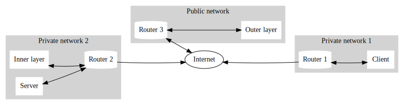

# socket-gateway


An API Gateway based on websockets to expose HTTP(S) endpoints not reachable from the Internet - implemented in node.js.
The gateway allows you to reach endpoints not reachable due to NAT, ISP restrictions, or any other reasons.



In the preceding scenario `Client` can not directly connect to `Server` as no connection to `Router 2` can be established from the `Internet`.
When using the socket-gateway the inner layer (a component that is able to establish a connection to `Server`) creates a persistent websocket connection (`Inner layer -> Router 2 -> Internet -> Router 3 -> Outer layer`) to the outer layer (a compoent that can be connected to from the `Internet`).
The outer layer uses that connection to forward requests to the target network (if allowed).
`Client` can connect to `Server` using the socket-gateway via `Client -> Router 1 -> Internet -> Router 3 -> Outer layer -> Router 3 -> Internet -> Router 2 -> Inner layer -> Router 2 -> Server`.
 
### Docker 🐳
```bash
# https://hub.docker.com/r/markushinz/socket-gateway/tags
docker pull markushinz/socket-gateway:latest
```
### npm

```bash
# npm https://github.com/markushinz/socket-gateway/releases
npm install -g https://github.com/markushinz/socket-gateway/releases/latest/download/socket-gateway.tgz

socket-gateway certificates # generate key pair (innerLayer.crt and innerLayer.key)
echo '{"targets":{"localhost":{"hostname":"jsonplaceholder.typicode.com"}}}' > targets.yaml

socket-gateway outer-layer \
  --public-key innerLayer.crt \
  --targets targets.yaml \
  --app-port 3000 \
  --socket-port 3001 # keep running

socket-gateway inner-layer \
  --private-key innerLayer.key \
  --outer-layer ws://localhost:3001 # keep running

curl http://localhost:3000 # just like curl https://jsonplaceholder.typicode.com
```

## Prerequisites

* **Outer Layer**: A machine/server that is reachable from the Internet (usually cloud hosted).
* **Inner Layer(s)**: A machine/server that is able to reach the desired endpoint(s) (usually a machine/server located in the same LAN) that is able to reach the Internet. The other way round is not required! If you deploy multiple inner layers, the requests will be forwarded to the different inner layers using a custom scheduling technique.

## Deployment

### Outer Layer

Define host mappings between DNS names of the gateway (outer layer) and request targets. Keep in mind that multiple A or CNAME DNS records can point to the same outer layer 🥳! Check the following example:

```yaml
targets:
  "socket.gateway": # DNS name of the outer layer
    protocol: "https" # optional, target protocol, defaults to "https"
    hostname: "my.private.api" # required, target hostname
    port: 443 # optional, target port, defaults to 443
    policy: # optional, defaults to *
      # /helloworld gets compiled to ^/helloworld$
      # specify paths with a leading ^ if you want to use more advanced regexes
      "/helloworld": # allowed path(s), may be *
        - "GET"
        - "POST" # allowed method(s), may be or include *
    identifier: "inner-layer" # optional, identifier or list of identifiers to route to. If not specified, requests will get routed to any connected inner layer
```

Now, all requests that are allowed py the specified policy that have the request header "host" set to "socket.gateway" get proxied to "my.private.api".

### Inner Layer

*Optional*: Provide an environment variable `NODE_EXTRA_CA_CERTS` to extend the well known "root" CAs for your private APIs. This is also required if the outer layer uses a self-signed certificate.
