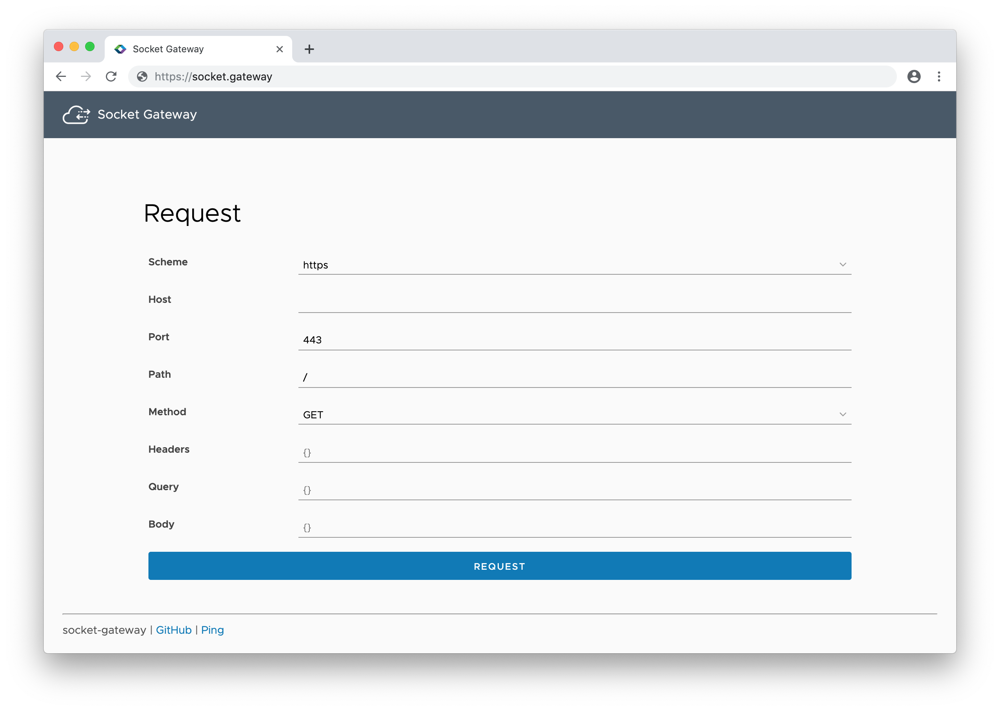

# socket-gateway

A gateway implementation based on websockets to expose endpoints not reachable from the Internet.

The gateway allows you to reach endpoints not reachable due to NAT, ISP restrictions, or any other reasons.

 

## Prerequisites

* **Outer Layer**: A machine/server that is reachable from the Internet (usually cloud hosted).
* **Inner Layer(s)**: A machine/server that is able to reach the desired endpoint(s) (usually a machine/server located in the same LAN) that is able to reach the Internet. The other way round is not required. If you deploy multiple inner layers, the requests will be forwarded to the different inner layers using round robin scheduling.

### Certificates

* Two certificates for mutual authentication of the two layers. Such certificates can be created with the following commands:

```
outerLayer=dns.outer.layer

echo -e "[req]\ndistinguished_name = req_distinguished_name\nx509_extensions = v3_req\nprompt = no\n[req_distinguished_name]\nCN = socket-gateway-inner-layer\n[v3_req]\nsubjectAltName = @alt_names\n[alt_names]\nDNS.1 = socket-gateway-inner-layer" > innerLayer.conf
openssl req -x509 -nodes -days 365 -newkey rsa:4096 -keyout innerLayer.key -out innerLayer.crt -config innerLayer.conf -extensions "v3_req"

echo -e "[req]\ndistinguished_name = req_distinguished_name\nx509_extensions = v3_req\nprompt = no\n[req_distinguished_name]\nCN = $outerLayer\n[v3_req]\nsubjectAltName = @alt_names\n[alt_names]\nDNS.1 = $outerLayer" > outerLayer.conf
openssl req -x509 -nodes -days 365 -newkey rsa:4096 -keyout outerLayer.key -out outerLayer.crt -config outerLayer.conf -extensions "v3_req"
```

* A sever certificate for the outer layer. Let's Encrypt is your friend 😉. Alternatively, you can also use the outer layer certificate you just created.


## Deployment

### Outer Layer

The outer layer exposes the gateway functionality on port 3000 (environment variable "PORT") and accepts connections from (the) inner layer(s) on port 3001 (environment variable "SOCKET_PORT"). Certificate and configuration files must be placed in the `./config` directory.

Put files `server.crt`, `server.key`, `innerLayer.crt`, `outerLayer.crt`, and `outerLayer.key` into `./config/`. The certificates are used for TLS connections from/to clients as well as from/to the inner layer. Create a file `./config/policies.json` to define which request should be allowed. Check the following example:

```
{
    "my.private.api": {         // allowed host(s)
        "443": {                // allowed port(s), may be *
            "/": [              // allowed path(s), may be *
                "GET", "POST"   // allowed method(s), may include *
            ]
        }
    }
}
```

Check `config.js` and `policy.js` on how to change further (environment) variables and how `policies.json` is parsed.

### Inner Layer

The inner layer requires an environment variable "OUTER_LAYER"=dns.outer.layer:port. Certificate files must be placed in the `./config` directory.

Put files `innerLayer.crt`, `innerLayer.key`, and `outerLayer.crt` into `./config/`. The certificate is used for TLS connections from/to the outer layer.

*Optional*: Provide an environment variable `NODE_EXTRA_CA_CERTS` to extend the well known "root" CAs for your private APIs.

Check `config.js` on how to change further (environment) variables.

Finally, set the URL of the outer layer as an environment variable `OUTER_LAYER`.

## Gateway

Use one of the following ways to use the gateway.

Be aware that header values will be sanitized before forwarding them. The following headers will be removed:

*host, accept, accept-charset, accept-encoding, accept-language, accept-ranges, cache-control, content-encoding, content-language, content-length, content-location, content-md5, content-range, content-type, connection, date, expect, max-forwards, pragma, proxy-authorization, referer, te, transfer-encoding, user-agent, via*

This gateway is **no** reverse proxy. Both absolute and relative paths from subsequent requests (i.e. loading stylesheets) will likely result in an error.

### A) Prepend host to path

If you want to perform "GET https://my.private.api/router?key=value" through the gateway, simply perform "GET https://socket.gateway/my.private.api/router?key=value".

The request path, method, headers, query and body will be forwarded, too. The schema is fixed to "https" and the port is fixed to "443".

### B) Perform "POST /"

Perform a `POST /`request with the following JSON body:

```
{
	"schmea" : "https",        // optional, either http or https, defaults to https
	"host": "my.private.api",  // required
	"port": "443",             // optional, defaults to 80 if http else 443
	"path": "/",               // optional, defaults to /
	"method": "GET",           // either HEAD, GET, POST, PUT, DELETE, defaults to GET
	"headers": {},             // optional
	"query": {},               // optional
	"body": {}                 // optional
}
```

You may also use the provided form at `GET /` to perform the request.
